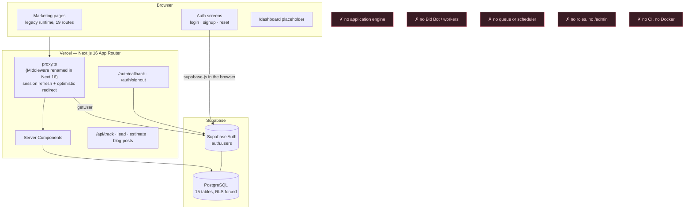
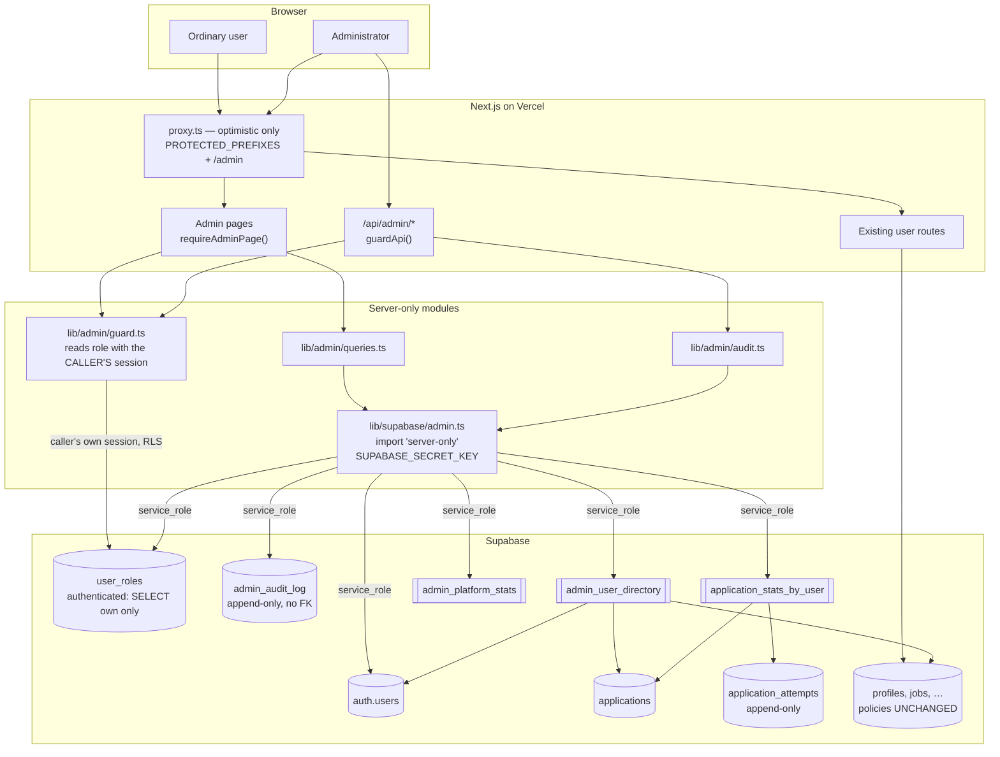
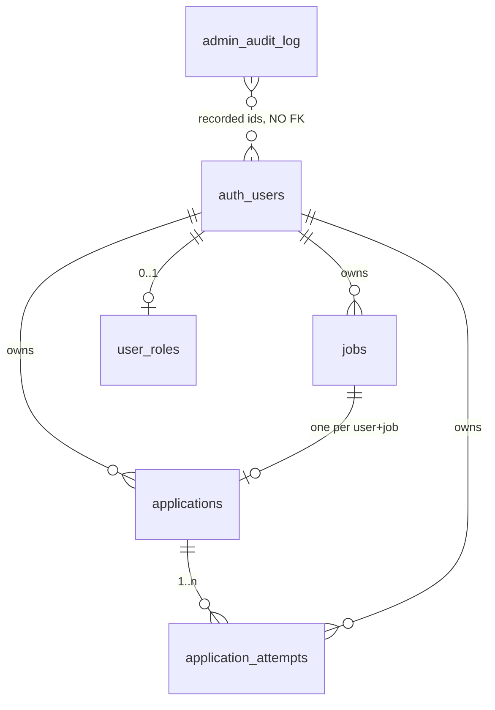
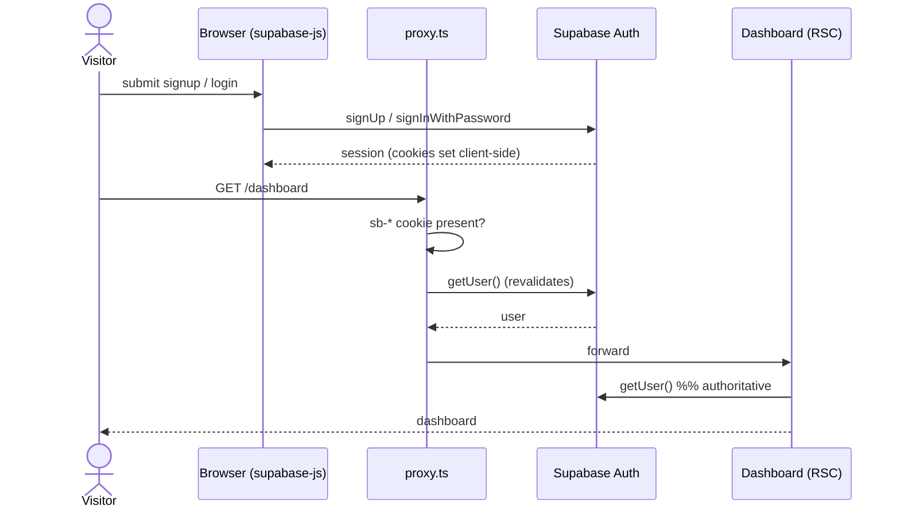
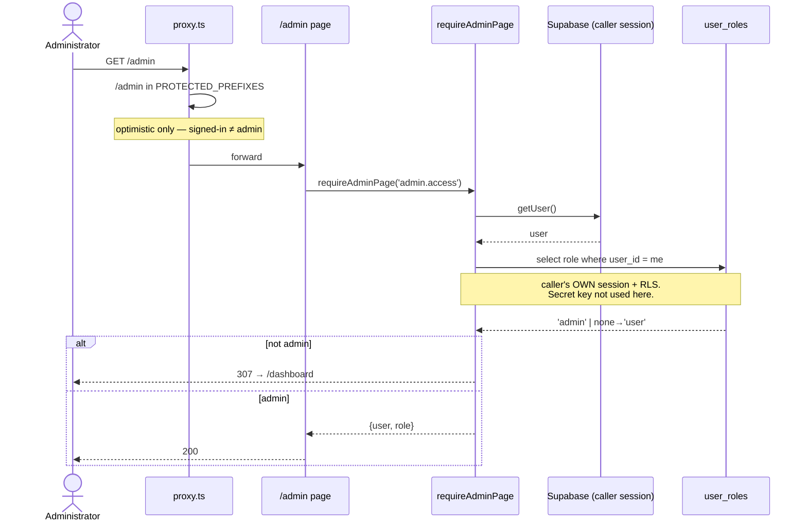
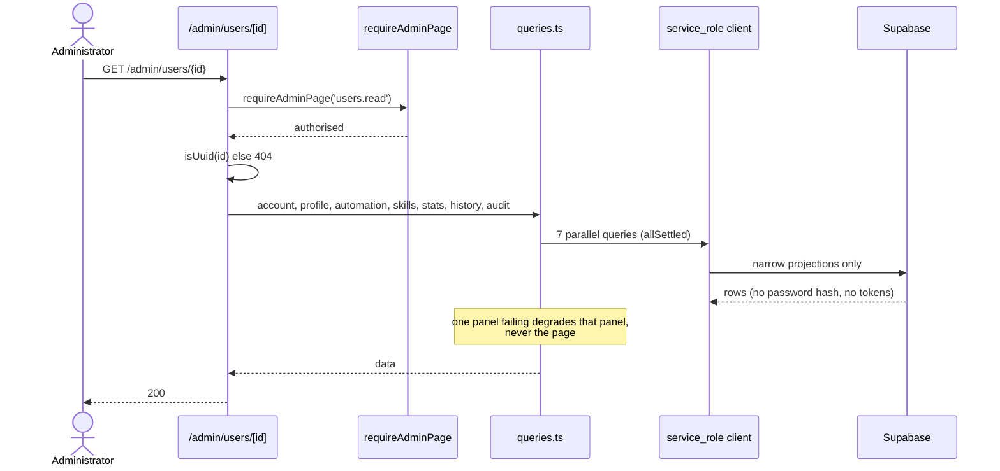
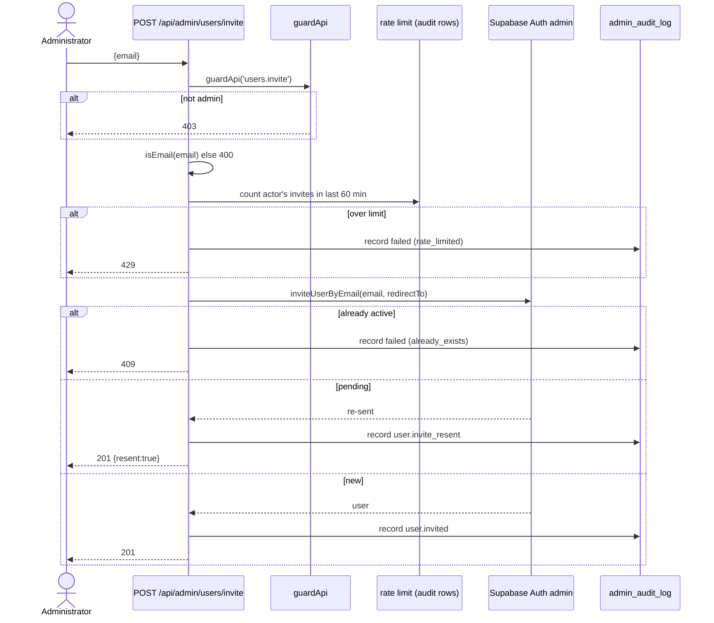
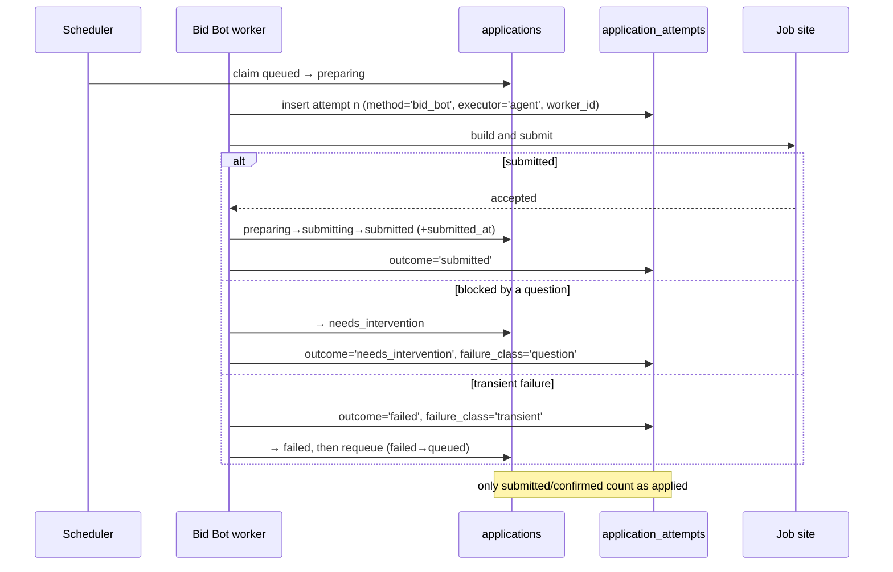

# KIASA administrator system

Discovery, architecture, security review and operational runbook for the
administrator layer added in `feature/admin-system`.

**Status:** implemented, tested against a local Supabase stack, **not deployed**.
No Vercel or hosted-Supabase credentials were available during this work; see
[Deployment](#deployment) for the exact handoff steps.

---

## 1. Discovery

### 1.1 Which repository serves kiasa.tech

Two candidates existed. The deployed one was identified from production
behaviour rather than from the repository name:

| | `KIA - 1` | **`KIA - 3`** |
|---|---|---|
| Remote | `chrislim0067/KIASA.git` | `chrislim0067/KIASA.tech.git` |
| Package | `kiasa-site` | `kiasa` |
| History | 1 commit (2026-08-05) | active |
| Supabase | none | `@supabase/ssr` + 13 migrations |

Production `GET /dashboard` answers `307 → /login?redirectTo=%2Fdashboard`. That
redirect — specifically the fact that it *sets* `redirectTo` — is produced only
by the anonymous fast-path branch in `lib/supabase/proxy-session.ts`, which
exists solely in `KIA - 3`. `KIA - 1` contains no authentication code. Response
headers confirm `Server: Vercel` and `X-Nextjs-Prerender`.

`origin/main` is the deployment source.

### 1.2 What could not be inspected

| Resource | Status | Consequence |
|---|---|---|
| GitHub account | `gh` not authenticated | Repository set not enumerated; deployed repo inferred from production behaviour instead. |
| Vercel | no CLI, no token | Project settings, domains, env vars and deployment logs unverified. |
| Supabase (hosted) | no CLI auth, no keys | **Not confirmed that production has migrations 1–13 applied.** The local migration set is the only source of truth used here. |
| Docker (KIASA) | n/a | No Dockerfile or compose file exists in the repository. |

Everything below marked *verified* was verified against a local stack.

### 1.3 The finding that shaped the work

**KIASA does not apply to jobs yet.** The pipeline in migrations 12–13 is intake
only:

```
received → fetching → fetched → extracting → extracted → archived
```

Verified absences at the time of discovery:

- no `applications` table, and no column recording an application anywhere;
- no Bid Bot — `workers/` contained one file, `.gitkeep`;
- no queue, scheduler, cron, webhook or background worker;
- no Docker, no `.github/`, no CI configuration;
- no role or admin concept; `/admin` returned **404** in production.

`automation_settings.max_applications_per_day` exists, but it is a *user
preference*, not a record of anything that happened.

So every metric the administrator surface was asked for — applied, succeeded,
failed, manual vs automated vs Bid Bot — was unanswerable. Deriving them from
job-intake state would have been fabrication: `extracted` means "we read the
posting", not "we applied". Section 4 is the schema that makes them real.

---

## 2. AS-IS architecture



**Authentication.** Supabase Auth with cookie sessions via `@supabase/ssr`.
Two-layer route protection: `proxy.ts` performs an *optimistic* redirect, and
the page itself calls `supabase.auth.getUser()` as the authoritative check.
`getUser()` revalidates with Supabase rather than trusting the cookie. This is
the correct pattern and the admin layer follows it exactly.

**Database.** 15 tables before this work, RLS enabled *and forced*, every policy
`(select auth.uid()) = user_id`, `anon` granted nothing, `service_role`
deliberately granted nothing. Migrations self-verify and abort on a wrong result.
Two append-only evidence tables (`job_snapshots`, `job_events`) are immutable by
trigger, not merely by withheld grant — because `postgres` and `service_role`
carry `BYPASSRLS` and a policy would not bind them.

**Pre-existing weaknesses relevant to this work**

1. No authorization model of any kind — only authenticated vs not.
2. No way to answer any application or Bid Bot question (§1.3).
3. No CI: nothing runs `typecheck`, `lint`, `build` or the 12 test scripts on
   push. Everything is manual.
4. No `.env.example`; required variables were undocumented. *(Fixed here.)*
5. `main` is deployed directly with no preview gate.
6. Migrations are applied manually — no automated `db push` on deploy.

Items 3, 5 and 6 are outside this change's scope and are listed in §11.

---

## 3. TO-BE architecture



### Five decisions and why

**1. The admin check never uses the secret key.**
`getCallerRole()` reads `user_roles` through the caller's own session, permitted
by the `user_roles_select_own` policy. The elevated credential is only reached
*after* authorization has already passed. It also cannot recurse — there is no
`SECURITY DEFINER` helper in the loop, so the project rule asserted by migration
13 (nothing in `public` may be definer or carry an unpinned `search_path`) is
preserved and re-asserted by every new migration.

**2. Admin reads go through server handlers, not admin-shaped RLS.**
The alternative was adding "…or the caller is an admin" to the policy on every
user table. That was rejected: it would put an admin bypass on `profiles`,
`jobs`, `applications` and everything else, so one mistake in that predicate
would expose every user's data through PostgREST to any signed-in browser.
Keeping elevation in server code confines it to handlers that already called
`requireAdmin()`. **No existing policy was modified by this work.**

**3. Absence of a role row means `user`.**
No backfill, no migration risk for existing accounts, and a failed read degrades
to *least* privilege rather than most.

**4. Roles are a CHECK, capabilities are the API.**
`user_roles.role` is a CHECK constraint (matching every other constrained
vocabulary in this schema) rather than a PG enum, which cannot drop a value.
Authorization is written against capabilities — `can(role, 'users.delete')` —
never against a role name. Adding `support` or `reviewer` later is one CHECK
change plus one entry in `ROLE_CAPABILITIES`; every call site keeps working. No
speculative roles are declared: the mechanism is ready, the vocabulary is not
cluttered.

**5. Two views are owner-executed, and that is contained.**
`service_role` **cannot** `SELECT auth.users` — verified, not assumed:
`has_table_privilege('service_role','auth.users','SELECT') = false`. So
`admin_user_directory` and `admin_platform_stats` cannot be `security_invoker`.
Containment: a narrow projection that excludes every password hash and token
(migration 16 *fails* if a secret column is ever added), a single grantee
(`service_role`), and no PostgREST exposure to any browser role.
`application_stats_by_user` **is** `security_invoker=true` because it reads only
our own tables — a view left at the default would run as `postgres` and read
across all users.

---

## 4. Application analytics — the data model



**`applications`** — one row per (user, job): the logical application and its
current state. `UNIQUE (user_id, job_id)` is the duplicate control, so a second
attempt to apply to the same posting collides rather than double-counting.

**`application_attempts`** — append-only ledger, one row per execution attempt.
Authoritative. `method` is carried per attempt, not read from the parent,
because a retry may legitimately switch mechanism (Bid Bot fails, a human
finishes manually) and that history would otherwise be lost the moment the
parent row updated.

### Lifecycle

```
queued → preparing → submitting → submitted → confirmed
   ↓         ↓            ↓            ↓
cancelled  failed    needs_intervention  failed
skipped    skipped
duplicate
```

`failed` and `skipped` may return to `queued` (retry). `confirmed`, `cancelled`
and `duplicate` are terminal. Enforced by
`guard_application_status_transition()`; mirrored in `lib/applications/state.ts`
with a parity test asserting the two sets are identical in **both** directions.

`discovered` and `matched` are deliberately **not** application states — a job is
discovered by the intake pipeline, which has its own state machine and event
log. Duplicating them would create two sources of truth. `jobs.status` was not
extended and its guard trigger is unchanged.

### The countability rule

**An application counts as successfully applied only in `submitted` or
`confirmed`.** A bot *beginning* work is not success; `preparing` and
`submitting` are in flight. This is defined once in `SUCCESS_STATUSES` and every
report derives from it, so the definition cannot drift between the dashboard,
the detail page and SQL.

### Bid Bot attribution

`method` is a first-class constrained value — `manual | automated | bid_bot |
external` — so Bid Bot metrics are a column comparison, **never a log search**.
`bid_bot` is a peer of `automated`, not a flag on it, because a metric whose
correctness depends on remembering to also filter a boolean eventually gets
reported wrong.

Three distinct figures are exposed, because they are three different facts:

| Figure | Meaning |
|---|---|
| `bid_bot_total` | applications Bid Bot handled, whatever the outcome |
| `bid_bot_succeeded` | of those, actually submitted or confirmed |
| `bid_bot_attempts` | execution attempts — exceeds the above when work was retried |

The fixture test asserts all three are different numbers (15 / 4 / 21), so one
cannot silently stand in for another.

**Until an engine writes to these tables every figure is zero, and the UI says
so explicitly** rather than presenting a wall of zeros as a measurement.

---

## 5. Administrator surface

| Route | Capability | Notes |
|---|---|---|
| `/admin` | `admin.access` | Overview. One-row `admin_platform_stats` query. |
| `/admin/users` | `users.list` | Paginated, searchable, filterable, sortable. |
| `/admin/users/[userId]` | `users.read` | Profile, automation, stats, history, audit. |
| `/admin/audit` | `audit.read` | Append-only log. |
| `GET /api/admin/users` | `users.list` | Programmatic + HTTP-testable boundary. |
| `POST /api/admin/users/invite` | `users.invite` | |
| `DELETE /api/admin/users/[userId]` | `users.delete` | |
| `PUT /api/admin/users/[userId]/role` | `roles.grant` | |

Pages are server-rendered with state in the URL: filtered lists are linkable and
back-button-correct, search is an indexed query rather than a filter over an
already-fetched page, and no user data reaches a client bundle. **One grouped
query per page — never a query per user.**

Built on the existing `styles/auth.css` tokens (same palette, same
Syncopate/Rajdhani pairing) so `/admin` reads as part of KIASA. Below 900px the
user table becomes stacked cards labelled from `data-label`, so it degrades
without a horizontal scrollbar and without a second markup path.

### Invitation

Supabase's own `inviteUserByEmail`. KIASA does not mint tokens or send its own
mail — that would be a second, unreviewed credential path into the same
accounts. `redirectTo` is built from `NEXT_PUBLIC_SITE_URL`, **never** from the
request `Host`: an invitation carrying an attacker-chosen link is a phishing
message sent from KIASA's own domain.

Handled: already-active account → 409; pending account → invitation re-sent
(what an administrator means by inviting twice); invalid address → 400;
upstream rate limit → 429.

### Deletion

| | Soft (default) | Hard |
|---|---|---|
| Effect | `auth.users.deleted_at` set | row removed |
| Data | fully retained | **destroyed by cascade** |
| Reversible | yes | no |
| Confirmation | dialog | dialog **+ type the email address** |

Hard deletion cascades to: `profiles`, `job_preferences`, `automation_settings`,
`work_authorizations`, `work_experiences`, `education_entries`, `skills`,
`certifications`, `projects`, `languages`, `verified_answers`, `jobs`,
`job_snapshots`, `job_facts`, `job_events`, `applications`,
`application_attempts`, `user_roles`.

**No cascade was introduced by this work.** Those constraints predate it, and
migration 12 already *requires* them. The two new tables follow the same
convention and migration 15 asserts it.

`admin_audit_log` is the exception — see §7.

Refused server-side (not merely hidden in the UI): deleting your own account,
and deleting the last remaining administrator.

**Session termination.** Hard deletion removes the `auth.users` row, so
`getUser()` fails immediately and every existing session is dead at once. Soft
deletion blocks sign-in; an already-issued access token remains technically
valid until it expires (`jwt_expiry`, 3600s by default). If a hard cut-off is
required for soft deletion, that is open work — see §11.

---

## 6. Sequence diagrams

### Registration and login (existing, unchanged)



### Administrator authorization



### Viewing a user's statistics



### Inviting a user



### Deleting a user

```mermaid
sequenceDiagram
  actor A as Administrator
  participant UI as DeleteUserDialog
  participant API as DELETE /api/admin/users/[id]
  participant G as guardApi
  participant OP as lib/admin/users
  participant SB as Supabase Auth admin
  participant AL as admin_audit_log

  A->>UI: open dialog
  UI-->>A: show target + exactly what is destroyed
  alt permanent
    A->>UI: type the email address
  end
  UI->>API: DELETE {confirmUserId, mode}
  API->>G: guardApi('users.delete')
  API->>API: isUuid(id); confirmUserId === id else 400
  API->>OP: deleteUser
  OP->>OP: refuse self; refuse last administrator
  OP->>SB: deleteUser(id, softDelete)
  SB-->>OP: ok
  Note over SB: hard → cascade removes all owned rows<br/>audit log survives (no FK)
  API->>AL: record user.deleted (succeeded or failed)
  API-->>A: 200 / 409 / 400
```

### Bid Bot application *(design — the engine does not exist yet)*



---

## 7. Security review

### Verified by test (102 checks)

| Concern | Result |
|---|---|
| **Privilege escalation** | INSERT / UPDATE / UPSERT of own role all refused (`42501`); no row created. `authenticated` holds SELECT and nothing else on `user_roles`. |
| **Escalation over HTTP** | `PUT /role` as an ordinary user → 403; no role granted. |
| **Vertical authz — API** | anonymous → 401; ordinary user → 403; admin → 200. |
| **Vertical authz — pages** | anonymous → 307 `/login`; ordinary user → 307 `/dashboard`. |
| **IDOR** | ordinary user cannot open another user's detail page or read their rows; admin acting on another id is the authorised case. |
| **User enumeration** | `admin_user_directory`, `admin_platform_stats`, `application_stats_by_user`, `admin_audit_log` all unreadable by `anon` and `authenticated`. |
| **Horizontal data isolation** | a user cannot read or create another user's applications. |
| **Injection (filter)** | `a,b)(c"d\e` as a search returns 200 and **zero** rows — no filter confusion, no table dump. |
| **Secret exposure** | no `encrypted_password`, `recovery_token`, `confirmation_token`, `refresh_token` or `access_token` in any admin response. |
| **Audit integrity** | UPDATE refused for `service_role` *and* for the table owner (trigger, not policy). |
| **Audit secret leakage** | no secret-shaped key reaches `detail`; recursive scrub asserted. |
| **Destructive-action safety** | malformed id → 400; missing confirmation → 400; mismatched confirmation → 400; self-delete → 409; account survives all refusals. |
| **Cascade correctness** | hard deletion removes applications and attempts; the audit record survives. |

### By design

**CSRF.** Supabase auth cookies are `SameSite=Lax`, so a cross-site `DELETE`
or `POST` does not carry them. The confirmation-id echo is a second layer: a
cross-origin caller cannot read the page to learn the id.

**XSS.** All rendering is React with default escaping. No `dangerouslySetInnerHTML`
anywhere in the admin surface. Admin-authored free text (the role-change note)
is stored and re-rendered through React.

**SQL injection.** PostgREST parameterises values. The exposure at the boundary
is *filter* confusion in `or=`, addressed by `quoteFilterValue()` (control
characters stripped, backslashes and quotes escaped, value double-quoted) plus
`escapeLikeLiteral()` for `%`/`_`. Tested above.

**Least privilege.** The secret key is read in exactly one module, which begins
`import 'server-only'` — the build *fails* if anything reachable from a Client
Component imports it. It is never used for work the caller's own session could
do. `service_role` holds SELECT-only on the application tables and is granted on
just two admin tables.

**Caching.** Every admin response sets `no-store, max-age=0, must-revalidate`;
every admin page is `force-dynamic` with `robots: noindex, nofollow, nocache`.

**Query-string exposure.** Filters carry only role/status/search terms. No id or
token is placed in a URL that is not already the resource path.

**Rate limiting.** Counted from durable `admin_audit_log` rows, not an in-memory
map — on Vercel a module-level counter resets per instance and per cold start,
which looks like protection and is not. Because failures are audited too, the
limit cannot be evaded with failing requests. It **fails open** by design: it
blunts abuse by an already-authenticated administrator, and locking all
administrators out because a `COUNT` failed would be a worse outage.

### The bug the tests found

`admin_audit_log` originally referenced `auth.users` with `ON DELETE SET NULL`.
That action is implemented as an **UPDATE**, which the immutability trigger
refuses — so `delete from auth.users` failed for any account appearing in the
log. **User deletion was silently broken**, and it would have shipped: it
passes typecheck, lint, build and every migration self-check.

Fixed by removing the foreign keys entirely. An audit row is a historical
statement, not a live reference; the ids are recorded values and the emails are
snapshots. `ON DELETE CASCADE` would have been worse — deleting a user would
erase the record that they were deleted. Migration 14 now **fails** if any FK is
added to that table.

### Residual risks

1. Soft deletion leaves an access token valid for up to `jwt_expiry` (~1h).
2. Rate limiting fails open (deliberate, documented above).
3. Owner-executed views (§3.5) — contained, but they are the one place where a
   future widened grant would matter. The migration asserts the grant set.
4. Production RLS state is **unverified** (§1.2) — run §9 step 3.

---

## 8. Changes

### Migrations (all new, none altered)

| File | Adds |
|---|---|
| `20260908000014_roles_and_admin_audit.sql` | `user_roles`, `admin_audit_log`, guards, self-verification |
| `20260908000015_applications_and_attempts.sql` | `applications`, `application_attempts`, transition guard, `application_stats_by_user` |
| `20260908000016_admin_user_directory.sql` | `admin_user_directory`, name-search index |
| `20260908000017_admin_platform_stats.sql` | `admin_platform_stats` |

No existing table, policy, grant, trigger or function was modified.

### Environment variables

| Variable | Scope | Status |
|---|---|---|
| `SUPABASE_SECRET_KEY` | **server only** | **NEW — required for /admin** |
| `NEXT_PUBLIC_SITE_URL` | public | **NEW —** recommended; invitation links |
| `NEXT_PUBLIC_SUPABASE_URL` | public | existing |
| `NEXT_PUBLIC_SUPABASE_PUBLISHABLE_KEY` | public | existing |

`SUPABASE_SECRET_KEY` **must not** carry a `NEXT_PUBLIC_` prefix. With it unset
the site runs normally and `/admin` reports that the surface is not configured;
nothing else degrades.

### Vercel / Supabase / Docker

- **Vercel:** two environment variables to add. No build, output, domain or
  routing change. No `vercel.json` introduced.
- **Supabase:** four migrations to apply. No auth-provider, storage, Edge
  Function or cron change.
- **Docker:** none. KIASA has no Docker artifacts; the local Supabase stack is
  the CLI's own containers.

---

## 9. Deployment

> Not performed — no credentials were available. These are the exact steps.

**1. Preview.** Push `feature/admin-system`, open a PR. Vercel builds a preview.
The admin surface will report "not configured" until step 2.

**2. Environment.** Add to the Vercel project (Preview first, then Production):
`SUPABASE_SECRET_KEY` (from Supabase → Project Settings → API), and
`NEXT_PUBLIC_SITE_URL=https://www.kiasa.tech`. Redeploy.

These steps go through `scripts/supabase.mjs`, which runs the **pinned** CLI
from `node_modules` and refuses to fall back to `npx`. A bare `supabase` on
PATH is whatever happens to be installed, and the version that migrates
production should be the version the migrations were proven against.

**3. Verify the production baseline before migrating.**
```bash
node scripts/supabase.mjs link --project-ref <ref>
node scripts/supabase.mjs migration list      # confirm 1–13 are applied
```
If they are not, stop — this branch assumes them.

**4. Apply migrations.**
```bash
node scripts/supabase.mjs db push             # applies 14–17
```
Each aborts on its own verification failure, so a partial or wrong apply fails
loudly rather than silently.

**5. First administrator.**
```bash
SUPABASE_SECRET_KEY=… node scripts/bootstrap-admin.mjs you@kiasa.tech
node scripts/bootstrap-admin.mjs --list
```
The account must already exist. The script grants a role; it cannot create a
login. Every run writes an `admin.bootstrapped` audit row.

Rejected alternatives, and why: *first account becomes admin* (a race anyone can
win); *`/make-me-admin`* (a public escalation endpoint); *email hardcoded in the
frontend* (published in the client bundle); *migration inserting a user id* (the
id does not exist until that person registers, and it commits a real person's
identity to the repository).

**6. Merge to `main`** — Vercel deploys production.

### Production verification checklist

- [ ] `https://www.kiasa.tech/` renders; hero initialises
- [ ] login, logout, forgot-password, reset-password all work
- [ ] `/dashboard` still redirects when signed out
- [ ] `/admin` signed out → `/login?redirectTo=%2Fadmin`
- [ ] `/admin` as an ordinary user → redirected to `/dashboard`
- [ ] `/api/admin/users` as an ordinary user → **403**
- [ ] `/admin` as the administrator → overview renders
- [ ] `/admin/users` lists, searches, paginates, sorts
- [ ] a user detail page shows profile, stats and history
- [ ] application and Bid Bot figures read **0** and are labelled as not-yet-recording
- [ ] invite a **test** address → email arrives → link works
- [ ] invite the same address again → "sent again", not an error
- [ ] delete a **test account you created** — never a real customer
- [ ] the deletion appears in `/admin/audit`
- [ ] job intake still works end to end

### Rollback

| Scenario | Action |
|---|---|
| UI or API problem | Vercel → redeploy the previous production deployment. **Instant.** The migrations are additive and harm nothing while dormant. |
| Need to revert code | `git revert 24a69d8` and push. Same effect. |
| Suspected key exposure | Rotate the secret key in Supabase, update Vercel, redeploy. `/admin` fails closed meanwhile. |
| Remove an administrator fast | `node scripts/bootstrap-admin.mjs <email> --revoke`, or `delete from public.user_roles where user_id = '…'`. Takes effect on their next request. |
| Schema rollback | Rarely needed — the tables are additive and nothing existing reads them. To remove: drop the four views and `application_attempts`, `applications`, `admin_audit_log`, `user_roles`. **This destroys audit history.** |

---

## 10. Testing

```bash
npm run typecheck && npm run lint && npm run build
npm run db:reset
npm run test:db          # 12 pre-existing suites + 65 new checks
npm run test:admin:api   # 37 HTTP checks (starts and stops its own server)
```

| Suite | Checks | Covers |
|---|---|---|
| `test-admin-authorization.mjs` | 32 | escalation, RLS, view exposure, isolation, transitions, ledger immutability, audit immutability, cascade |
| `test-application-metrics.mjs` | 33 | TS↔SQL state parity; every counter against hand-computed fixtures; Bid Bot attempted vs succeeded |
| `test-admin-api.mjs` | 37 | anon/user/admin against every endpoint and page, with **real** `@supabase/ssr` session cookies |

Sessions are not forged: the test drives `@supabase/ssr` with a capturing cookie
store, so the `Cookie` header is byte-identical to a browser's. A test inventing
its own cookie shape could pass while real sign-in was broken.

**Regression:** all 12 pre-existing suites pass, including the 108 security
regressions and the default-privilege audit.

**Known pre-existing flake:** `test-auth-flow.mjs` fails 1–2 of 48 checks
("preloader dismissed"), varying between identical runs. **Confirmed present on
`origin/main` without this branch** — not caused by this work. Note it takes an
origin argument defaulting to `http://localhost:3100`; running it against
`127.0.0.1` produces ~20 spurious failures because sign-out redirects to
`localhost`.

---

## 11. Open work

| Item | Why it matters |
|---|---|
| **No application engine or Bid Bot** | Every application metric is 0 until one writes to these tables. The schema and attribution are ready. |
| **No CI** | Nothing runs typecheck/lint/build/tests on push. This branch adds 102 checks that nothing will run automatically. |
| **Migrations applied manually** | No `db push` in the deploy pipeline; code can reach production before its schema. |
| **Production RLS unverified** | §1.2 — could not connect to hosted Supabase. |
| **Soft-delete token window** | Access token valid ≤1h after deactivation. |
| **`main` deploys directly** | No preview gate before production. |
| **`applications.attempt_count` is a projection** | The ledger is authoritative; nothing yet reconciles them on a schedule. |
| **No admin session timeout** | Admin sessions last as long as any other. |
